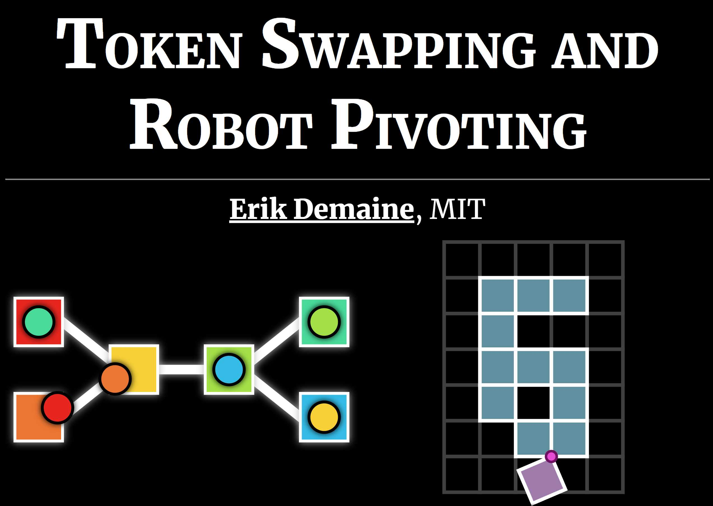

# Talk: Token Swapping and Robot Pivoting

This repository contains slides and animations for a talk presented at the
[Workshop on Rapid Reconfiguration of Programmable Matter](http://www.self-assembly.net/UCNC2021-prog-matter/)
at the
[19th International Conference on Unconventional Computation and Natural Computation (UCNC 2021)](https://ucnc2021.cs.aalto.fi/).

The talk mainly presents the results of two 2021 papers:

1. "[Hardness of Token Swapping on Trees](https://arxiv.org/abs/2103.06707)"
   by Oswin Aichholzer, Erik Demaine, Matias Korman, Jayson Lynch, Anna Lubiw,
   Zuzana Mas, Mikhail Rudoy, Virginia Vassilevska Williams, and Nicole Wein.
2. "[Characterizing Universal Reconfigurability of Modular Pivoting Robots](https://erikdemaine.org/papers/HingedPixels_SoCG2021/)"
   by Hugo Akitaya, Erik Demaine, Andrei Gonczi, Dylan Hendrickson, Adam Hesterberg, Matias Korman, Oliver Korten, Jayson Lynch, Irene Parada, and Vera Sacristán.

See the papers for more details about the results.

The first half of the talk builds on
[these slides about Token Swapping on Trees](https://github.com/edemaine/talk-token-swapping-robot-pivoting).

## [View Slides](https://edemaine.github.io/talk-token-swapping-robot-pivoting/)

[](https://edemaine.github.io/talk-token-swapping-robot-pivoting/)

## Technology: reveal.js + Pug + Stylus + CoffeeScript + SVG Tiler + SVG.js + KaTeX

This repository uses the
[reveal-pug-talk template](https://github.com/edemaine/reveal-pug-talk)
to make slides by combining the following technology (all free and open source):

* [reveal.js](https://revealjs.com/): a flexible HTML presentation framework,
  extendable by plugins and themes.  Here we use:
  * [Chalkboard](https://github.com/rajgoel/reveal.js-plugins/tree/master/chalkboard):
    enables live drawing annotation on the slides (using pen or touch or mouse)
  * [Merriweather](https://fonts.google.com/specimen/Merriweather) font
* [Pug](https://pugjs.org/): a concise indentation-based notation for HTML,
  which makes it easier to express reveal.js slides,
  and to mix together other languages.  Here we use:
  * [Stylus](https://stylus-lang.com/): a concise indentation-based notation
    for CSS (styling of HTML)
  * [CoffeeScript](https://coffeescript.org/): an indentation-based language
    that compiles to JavaScript
* [SVG Tiler](https://github.com/edemaine/svgtiler):
  a library for converting ASCII art into high-quality SVG graphics
* [SVG.js](https://svgdotjs.github.io/):
  a library that makes it easy to add animations to SVG drawings
* [KaTeX](https://katex.org): a library for translating LaTeX math into HTML
* [Gulp](https://gulpjs.com/): a tool that builds the Pug code into HTML

## Structure

Here's an overview of the individual files and what they do:

* [`gulpfile.coffee`](gulpfile.coffee): Definitions of `build` and `watch`
  rules that run Pug on `index.pug`.
* [`index.pug`](index.pug): Top-level Pug file that calls all other files.
  Defines the top-level structure of the document, but has no slides.
* [`intro.pug`](intro.pug): Title slide
  (included at the start and end of `index.pug`)
* [`tokens.pug`](tokens.pug): First half of the slides, about token swapping.
* [`robots.pug`](robots.pug): Second half of the slides, about pivoting robots.
* [`figures.coffee`](figures.coffee): code to convert ASCII art of modular
  robot configurations in `robots.pug` into SVG Tiler drawings.
  Class `robots` indicates square-grid robots;
  class `hexrobots` indicates hexagonal-grid robots.
* [`tokenswap.coffee`](tokenswap.coffee): SVG.js-based code to implement
  token-swapping animations, enabling `tokens.pug` to define a triggerable
  animation sequence on a slide with a single line:
  ```pug
  .tokenswap.fragment(data-swaps="4,3 4,2 4,1 3,2 3,1 2,1")
  ```
* [`robotpivot.coffee`](robotpivot.coffee): SVG.js-based code to implement
  robot-pivoting animations on top of SVG Tiler drawings from `figures.coffee`.
  This enables `robots.pug` to define a triggerable animation sequence on a
  slide with a single line:
  ```pug
  .robotpivot.fragment(data-target="id", data-pivots="1,5/-180@2,6/-90@3,6 3,1/-180@3,1")
  ```
  Here `data-pivots` gives the coordinates of a tile (such as `1,5` or `3,1`),
  and uses `/angle@coords` to indicate pivoting around a single center.
  In hexagonal examples, the centers can be specified as tile corners via e.g.
  `TL1,5` for the top-left corner of hex with coordinates (1, 5).
* [`gadgets.coffee`](gadgets.coffee): SVG.js-based code to implement a few
  specific animations of traversing the locking 2-toggle gadget.
* [`index.styl`](index.styl): Some custom reveal.js styling,
  and general tools for styling slides.
* [`tokens.styl`](tokens.styl): Styling specific to token swapping,
  including SVG figures.  (Check out the cool glow/shadow effects!)
* [`robots.styl`](tokens.styl): Styling specific to robot pivoting,
  including SVG figures.  (Check out the cool SVG animations!)
* [`cayley4.png`](cayley4.png): [Image from Wikimedia Commons](https://commons.wikimedia.org/wiki/File:Symmetric_group_4;_Cayley_graph_1,2,6_(1-based).png), licensed under CC-BY-SA
* [`L2T_states.svg`](L2T_states.svg): Figure 15(a) from [this paper](https://arxiv.org/pdf/2012.07556.pdf)
* [`degree1.svg`](degree1.svg): Figure 9 from [this paper](https://arxiv.org/pdf/2012.07556.pdf)
* [`merge-example.svg`](merge-example.svg): Figure from a future version of [this paper](https://arxiv.org/pdf/2012.07556.pdf)

## Build Instructions

To build the slides HTML (`index.html`) from the source files:

1. Install [NodeJS](https://nodejs.org/) if you haven't already.
2. Clone the repository
3. Run the following:

   ```sh
   npm install
   npm run build
   ```

If you're live-editing the file and want `index.html` to continually build
and update, use the following command:

```sh
npm run watch
```

To assemble just the needed files into a `dist` directory,
use the following command:

```sh
npm run dist
```

To deploy these files to GitHub Pages, use the following command:

```sh
npm run deploy
```
